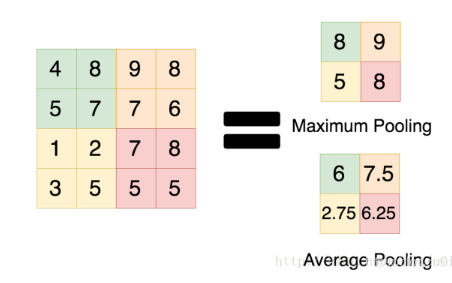
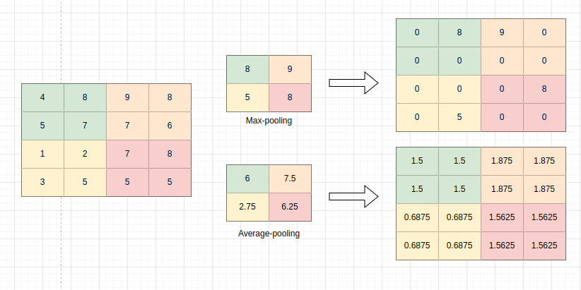

#### fc_backward

fc_forward 的过程是一个输入向量和一个矩阵相乘
$$
Out_{fc} = xW\\
其中，x\in \Bbb{R}^{1\times n}, W \in \Bbb{R}^{n\times m}, Out\in \Bbb{R}^{1\times m}
$$
记得链式法则，假如我们已经知道最终损失函数对当前fc层的输出$Out_{fc}$的导数： $\frac{\partial Loss}{\partial Out_{fc}}$

需要求：

- 对x的偏导（用以下一层链式）
- 权重W的偏导，并且更新权重W

首先看微分
$$
\begin{align}
d Loss &= tr(\frac{\partial Loss}{\partial Out_{fc}}^T dx W) + tr(\frac{\partial Loss}{\partial Out_{fc}}^T x dW)
\end{align}
$$
得到：
$$
\frac{\partial Loss}{\partial x} = \frac{\partial Loss}{\partial Out_{fc}}*W^T\\
\frac{\partial Loss}{\partial W} = x^T\frac{\partial Loss}{\partial Out_{fc}}
$$

#### pool_backward

参考: [深度学习：Pooling池化操作的反向梯度传播](https://blog.csdn.net/qinghuaci666/article/details/81870750)

pool池化操作分为两种，**均值池化**（average-pooling）和**最大值池化**（max pooling）

CNN中pooling的主要作用：

1. 降采样(downsampling) ，降维，去除冗余信息 （**主要**）
2. 实现非线性,在一定程度上防止过拟合
3. 实现特征不变性

先看其正向传播，再来看其反向传播

前向传播：

- max-pooling： 取 pool块中最大值作为输出位置的值
- average-pooling: 取 pool块中均值作为输出位置的值

反向传播：

池化操作因为对结构进行了修改，可以说是一个不可导的过程

例如，对于一个2\*2的池化层Pool， 假如在池化层之后的结果中有4\*4 =16个梯度，那么在池化层之前的一层将会有8\*8=64个梯度，导致梯度无法对位传播

解决办法是**保持传递的梯度（logg）总和不变**， 

- max-pooling： 在原最大值位置处填充梯度
  - max pooling的前向传播是把patch中最大的值传递给后一层，而其他像素的值直接被舍弃掉。**那么反向传播也就是把梯度直接传给前一层某一个像素，而其他像素不接受梯度，也就是为0。**
- Average-pooling： 将梯度的均值填充
  - Average pooling的前向传播就是把一个patch中的值求取平均来做pooling，那么反向传播的过程也就是把某个元素的梯度等分为n份分配给前一层，这样就保证池化前后的梯度（残差）之和保持不变，还是比较理解的，图示如下 

#### relu_backward

relu函数：
$$
\begin{align}
O &= ReLu(x)\\
&=\begin{cases}
x, & \text{if $x$>0}\\
0, & \text{else,$x$<=0}\\
\end{cases}
\end{align}
$$
relu梯度：
$$
\frac{\partial O}{\partial x} = \begin{cases}
1, & \text{if $x$>0}\\
0, & \text{else $x$ <=0}\\
\end{cases}
$$

#### conv_backward

举例说明吧

参考： [【CNN基础知识】一文详解反向传播](https://blog.csdn.net/qq_45912037/article/details/128073903)

先看其前向传播，假设有一个$3\times 3$的单通道输入矩阵，和一个$2\times 2$的卷积核
$$
\begin{pmatrix}
x_{11} & x_{12} & x_{13}\\
x_{21} & x_{22} & x_{23}\\
x_{31} & x_{32} & x_{33}\\
\end{pmatrix} *
\begin{pmatrix}
w_{11} & w_{12}\\
w_{21} & w_{22}\\
\end{pmatrix} = 
\begin{pmatrix}
o_{11} & o_{12}\\
o_{21} & o_{22}\\
\end{pmatrix}
$$
其中
$$
o_{11} = x_{11}w_{11} + x_{12}w_{12} + x_{21}w_{21} + x_{22}w_{22}\\
o_{12} = x_{12}w_{11} + x_{13}w_{12} + x_{22}w_{21} + x_{23}w_{22}\\
o_{21} = x_{21}w_{11} + x_{22}w_{12} + x_{31}w_{21} + x_{32}w_{22}\\
o_{22} = x_{22}w_{11} + x_{23}w_{12} + x_{32}w_{21} + x_{33}w_{22}\\
$$
先来看对权重的偏导, 可以发现，形式上和上面权重结果非常相像。
$$
\frac{\partial L}{\partial w_{11}} = \frac{\partial L}{\partial o_{11}}x_{11} + \frac{\partial L}{\partial o_{12}}x_{12} +\frac{\partial L}{\partial o_{21}}x_{21} + \frac{\partial L}{\partial o_{22}}x_{22}\\

\frac{\partial L}{\partial w_{12}} = \frac{\partial L}{\partial o_{11}}x_{12} + \frac{\partial L}{\partial o_{12}}x_{13} +\frac{\partial L}{\partial o_{21}}x_{22} + \frac{\partial L}{\partial o_{22}}x_{23}\\

\frac{\partial L}{\partial w_{21}} = \frac{\partial L}{\partial o_{11}}x_{21} + \frac{\partial L}{\partial o_{12}}x_{22} +\frac{\partial L}{\partial o_{21}}x_{31} + \frac{\partial L}{\partial o_{22}}x_{32}\\

\frac{\partial L}{\partial w_{22}} = \frac{\partial L}{\partial o_{11}}x_{22} + \frac{\partial L}{\partial o_{12}}x_{23} +\frac{\partial L}{\partial o_{21}}x_{32} + \frac{\partial L}{\partial o_{22}}x_{33}\\
$$
再进一步，其实权重的偏导，可以看做是输入矩阵和反向后一层的梯度$\frac{\partial L}{\partial O}$ 的卷积。
$$
\frac{\partial L}{\partial W} = conv(
\begin{pmatrix}
x_{11} & x_{12} & x_{13}\\
x_{21} & x_{22} & x_{23}\\
x_{31} & x_{32} & x_{33}\\
\end{pmatrix},

\begin{pmatrix}
\frac{\partial L}{\partial o_{11}} & \frac{\partial L}{\partial o_{12}}\\
\frac{\partial L}{\partial o_{21}} & \frac{\partial L}{\partial o_{22}}\\
\end{pmatrix}

)
$$

后面看重头戏，对X的偏导： $\frac{\partial L}{\partial X}$ 
$$ {align}
\begin{align}
\frac{\partial L}{\partial x_{11}} &= \frac{\partial L}{\partial o_{11}}w_{11}\\

\frac{\partial L}{\partial x_{12}} &= \frac{\partial L}{\partial o_{11}}w_{12} + \frac{\partial L}{\partial o_{12}}w_{11}\\

\frac{\partial L}{\partial x_{13}} &= \frac{\partial L}{\partial o_{12}}w_{12} \\

\frac{\partial L}{\partial x_{21}} &= \frac{\partial L}{\partial o_{11}}w_{21} + \frac{\partial L}{\partial o_{21}}w_{11}\\

\frac{\partial L}{\partial x_{22}} &= \frac{\partial L}{\partial o_{11}}w_{22} + \frac{\partial L}{\partial o_{12}}w_{21} +\frac{\partial L}{\partial o_{21}}w_{12} +\frac{\partial L}{\partial o_{22}}w_{11}\\

\frac{\partial L}{\partial x_{23}} &= \frac{\partial L}{\partial o_{12}}w_{22} + \frac{\partial L}{\partial o_{22}}w_{12} \\

\frac{\partial L}{\partial x_{31}} &= \frac{\partial L}{\partial o_{21}}w_{21} \\

\frac{\partial L}{\partial x_{32}} &= \frac{\partial L}{\partial o_{21}}w_{22} + \frac{\partial L}{\partial o_{22}}w_{21} \\

\frac{\partial L}{\partial x_{33}} &= \frac{\partial L}{\partial o_{22}}w_{22} \\
\end{align}
$$ {align}
实际上等价于

1. 将权重矩阵旋转180度

$$
\begin{pmatrix}
w_{11} & w_{12}\\
w_{21} & w_{22} \\
\end{pmatrix} \underrightarrow{rot180}
\begin{pmatrix}
w_{22} & w_{21}\\
w_{12} & w_{11} \\
\end{pmatrix}
$$

2. 再和下一侧的梯度 进行full mode 的卷积：

$$
\begin{pmatrix}
0 & 0 & 0 &0\\
0 & \frac{\partial L}{\partial o_{11}} & \frac{\partial L}{\partial o_{12}} & 0\\
0 & \frac{\partial L}{\partial o_{21}} & \frac{\partial L}{\partial o_{22}} & 0\\
0 & 0 & 0 &0\\

\end{pmatrix}
*
\begin{pmatrix}
w_{22} & w_{21}\\
w_{12} & w_{11} \\
\end{pmatrix}
$$

3. 得到结果：

$$
\begin{pmatrix}
\frac{\partial L}{\partial o_{11}}w_{11} & \frac{\partial L}{\partial o_{11}}w_{12} + \frac{\partial L}{\partial o_{12}}w_{11} & \frac{\partial L}{\partial o_{12}}w_{12} \\
\frac{\partial L}{\partial o_{11}}w_{21}+\frac{\partial L}{\partial o_{21}}w_{11} & \frac{\partial L}{\partial o_{11}}w_{22}+\frac{\partial L}{\partial o_{12}}w_{21}+\frac{\partial L}{\partial o_{21}}w_{12}+\frac{\partial L}{\partial o_{22}}w_{11} & 
\frac{\partial L}{\partial o_{12}}w_{22}+\frac{\partial L}{\partial o_{22}}w_{12}\\

\frac{\partial L}{\partial o_{21}}w_{21} & 
\frac{\partial L}{\partial o_{21}}w_{22} + \frac{\partial L}{\partial o_{22}}w_{21} & 
\frac{\partial L}{\partial o_{22}}w_{22}
\end{pmatrix}
$$

K=2

i: 0 , j: 0

- k=0

  - l=0
    (0,0)

  - l=1

    (0, 0)

- k=1

  - l=0
    ()

>reference:
>
>[Numpy实现神经网络框架(9)——卷积层反向传播推导及实现](https://zhuanlan.zhihu.com/p/70246295)
>
>[卷积核梯度计算的推导及实现](https://zhuanlan.zhihu.com/p/64248652)

